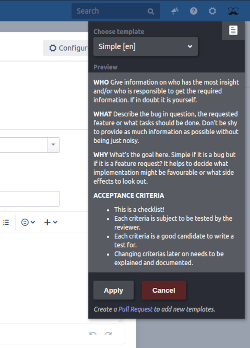

# Jira Description Templates

A simple tampermonkey/Greasemonkey plugin to inject predefined templates into _Jira_ issue descriptions. It uses _Jiras_ own rendering to preview those. Additionaly one can define `hints` that are used as preview to give additional hints on what kind of information should be provided for an issue.



## Templates

To create new templates or change existing ones you can create a [Pull Request](https://github.com/Bike24/jira-description-templates/edit/main/data/jira-description-templates.json).

Here is the schema for those templates.
```
{
  "$schema": "http://json-schema.org/draft-04/schema#",
  "type": "array",
  "items": [
    {
      "type": "object",
      "properties": {
        "id": {
          "type": "string"
        },
        "name": {
          "type": "string"
        },
        "content": {
          "type": "string"
        },
        "hints": {
          "type": "string"
        }
      },
      "required": [
        "id",
        "name",
        "content"
      ]
    }
  ]
}
```

## Installation

### Chrome

First you need to install [Tampermonkey](https://chrome.google.com/webstore/detail/tampermonkey/dhdgffkkebhmkfjojejmpbldmpobfkfo?hl=en).

Then you can install the latest version by clicking [here](https://github.com/Bike24/jira-description-templates/raw/latest/dist/jira-description-templates.user.js).

### Firefox

Not tested just yet, but one should use the [Greasemonkey](https://addons.mozilla.org/de/firefox/addon/greasemonkey/) plugin. PRs welcome for tested instructions.